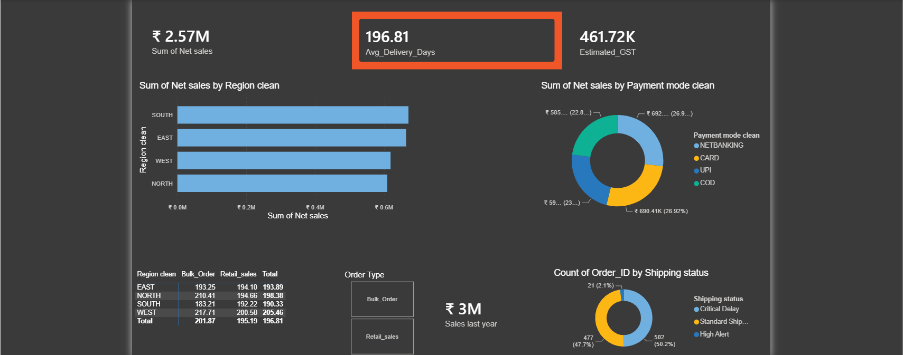

# 🛒 E-Commerce Supply Chain & Financial Operations Dashboard

**An end-to-end data analytics project deploying advanced Excel and Power BI architectures to optimize logistics and financial tracking.**

---

## 🎯 Project Objective
This project transforms unorganized, flat e-commerce spreadsheets into an enterprise-scale relational analytical tracking application. The dual-platform approach ensures robust structural data integrity on the backend while providing executive stakeholders with interactive, low-friction business intelligence (BI) dashboards.

## 🛠️ Tools & Technologies
* **Data Engineering & ETL:** Power Query
* **Data Modeling:** Power BI (Star Schema), Excel (Relational arrays)
* **Calculations & Logic:** DAX (Data Analysis Expressions), Advanced Excel Formulas (XLOOKUP, SUMIFS, AVERAGEIFS)
* **Visualization & BI:** Power BI Dashboards, Excel Pivot Charts, Dynamic Slicers

---

## 🏗️ Technical Architecture

### Phase 1: Structural Data Cleaning & ETL
* Standardized localized text anomalies, trailing white spaces, and case-sensitivity mismatches.
* Enforced data integrity using explicit Data Validation constraints.
* Engineered clean background ETL processing pipelines within Power Query to cast system data types and inject multi-nested conditional classification layers.

### Phase 2: Relational Data Modeling
* Segmented massive flat files into a production-grade **Star Schema**.
* Established a central transactional metric core (`Fact_sales`) surrounded by independent dimension lookup layers (`Dim_Customer`, `Dim_ProductTable`, `Dim_region`).
* Wired high-performance, single-directional 1-to-Many relationships.

### Phase 3: Advanced Calculation Engines
* **Excel Engine:** Bypassed fragile VLOOKUPs with modern `XLOOKUP` arrays. Constructed error-free financial layers to calculate Gross Sales, Discounts, and Net Sales.
* **DAX Engine:** Programmed a custom `CALENDARAUTO()` master table. Authored explicit DAX measures for Time Intelligence (`TOTALYTD`, `SAMEPERIODLASTYEAR`) and dynamic tax calculators.

### Phase 4: Executive UI/UX Design
* Deployed a high-contrast dark corporate executive workspace in Power BI for optimal scannability.
* Built dynamic, interactive Slicers and synchronized Pivot/Matrix Charts.
* Configured automated Exceptions Reporting using conditional matrix highlighting (e.g., flashing red for shipping bottlenecks).

---

## 📈 Key Business Insights
* **Logistical Bottlenecks:** Isolated a massive 205-day delivery bottleneck within Western logistics corridors.
* **Regional Optimization:** Validated the Southern territory as the most optimized fulfillment hub.
* **Payment Efficiency:** Mathematically proved that instant UPI transactions fulfill up to 18 days faster than traditional card processing setups.
